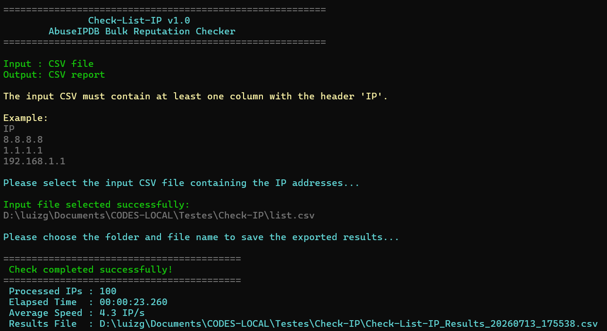
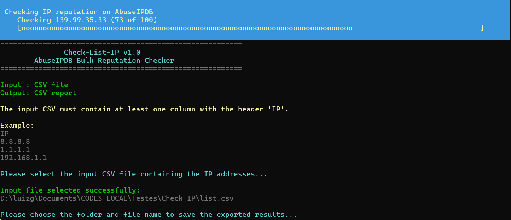

# Check-List-IP

PowerShell tool for checking the reputation of multiple IP addresses through the [AbuseIPDB API](https://www.abuseipdb.com/) and exporting the results to a CSV report.

The tool was designed to simplify bulk IP reputation checks during SOC investigations, threat hunting activities, incident response, and indicator analysis.



## Demonstration



## Features

- Checks multiple IP addresses in a single execution.
- Uses the AbuseIPDB API with a 90-day report history.
- Automatically detects a CSV column containing `IP` in its header.
- Displays a progress bar during processing.
- Calculates the total execution time and average processing speed.
- Exports a timestamped CSV report.
- Records API or connection errors in the exported report.
- Uses graphical dialogs to select the input file and output location.

## Requirements

- Windows operating system.
- Windows PowerShell 5.1 or PowerShell 7.
- Internet access.
- An AbuseIPDB API key.
- A CSV file containing an IP address column.

> The graphical file dialogs use `System.Windows.Forms`, so the script is intended to run on Windows.

## AbuseIPDB API key

1. Create an account at [AbuseIPDB](https://www.abuseipdb.com/).
2. Generate an API key from your account dashboard.
3. Open `Check-IP-List.ps1` in a text editor.
4. Locate the following line:

```powershell
$AbuseIPDBApiKey = "" # <====== Insert here your AbuseIPDB API Key
```

5. Insert your key between the quotation marks:

```powershell
$AbuseIPDBApiKey = "YOUR_API_KEY"
```

> Never publish or commit your real API key.

## Input CSV format

The input file must contain at least one column whose header includes `IP`. The recommended header is `IP`.

```csv
IP
8.8.8.8
1.1.1.1
192.168.1.1
```

Other columns may be included in the input file, but only the detected IP column is used for the reputation check.

## How to run

1. Download or clone this repository.
2. Configure your AbuseIPDB API key in `Check-IP-List.ps1`.
3. Open PowerShell in the tool directory.
4. Execute the script:

```powershell
.\Check-IP-List.ps1
```

5. Select the input CSV when the file dialog appears.
6. Choose the folder and filename for the exported report.
7. Wait for the processing to complete.

If the PowerShell execution policy prevents the script from running, you can use the following command for the current PowerShell process only:

```powershell
Set-ExecutionPolicy -Scope Process -ExecutionPolicy Bypass
```

Then run the script again.

## Exported report

The default output filename follows this pattern:

```text
Check-List-IP_Results_YYYYMMDD_HHMMSS.csv
```

The generated report contains the following fields:

| Column | Description |
| --- | --- |
| `IP` | IP address submitted to AbuseIPDB. |
| `AbuseConfidenceScore` | Abuse confidence score returned by AbuseIPDB, from 0 to 100. |
| `Status` | Local classification generated by the script. |
| `Country` | Country code associated with the IP address. |
| `Domain` | Domain associated with the IP address, when available. |
| `UsageType` | Network or service usage category returned by AbuseIPDB. |
| `TotalReports` | Total number of reports associated with the IP address. |
| `Error` | API or connection error details. A successful lookup contains `-`. |

## Status classification

The `Status` field is calculated locally using the AbuseIPDB confidence score:

| Abuse confidence score | Status |
| --- | --- |
| 0–49 | `Reliable` |
| 50–100 | `Suspicious` |
| Lookup failure | `Error` |

> This classification is intended to support initial triage. A reputation score alone should not be used as definitive evidence that an IP address is malicious or legitimate. Always correlate the result with additional context and telemetry.

## Working with the results in Excel

The exported CSV can be opened in Microsoft Excel for filtering, sorting, conditional formatting, charts, and investigation summaries.

For example, you can:

- Highlight `Reliable`, `Suspicious`, and `Error` results with different colors.
- Sort by `AbuseConfidenceScore` or `TotalReports`.
- Filter results by country, domain, or usage type.
- Create a summary showing the number of reliable and suspicious IPs.

Formatting, colors, charts, and additional summary columns are applied manually in Excel and are not generated by the PowerShell script.

## Error handling

If a lookup fails, the script continues checking the remaining IP addresses and records the failure in the `Error` column. Depending on the response, this field may contain an HTTP status code, an API message, a timeout, or another connection error.

## API limits

The number of IP addresses that can be checked depends on the request limit associated with your AbuseIPDB account and API plan. If the limit is exceeded, affected entries will be exported with `Status` set to `Error`.

Review the current limits in the official [AbuseIPDB API documentation](https://docs.abuseipdb.com/#api-daily-rate-limits).

## Use cases

- SOC alert triage.
- Threat hunting investigations.
- Incident response enrichment.
- Firewall or proxy log analysis.
- Validation of IP indicator lists.
- Bulk analysis before adding indicators to a SIEM or security platform.

## Disclaimer

This project is intended for legitimate cybersecurity analysis and educational purposes. Reputation data should be treated as supporting evidence and correlated with other security telemetry before taking action.

## Author

Developed by **Luiz Gustavo**.

- [GitHub](https://github.com/luizeus01)
- [YouTube](https://www.youtube.com/@LuizGustavoCyberSec)
