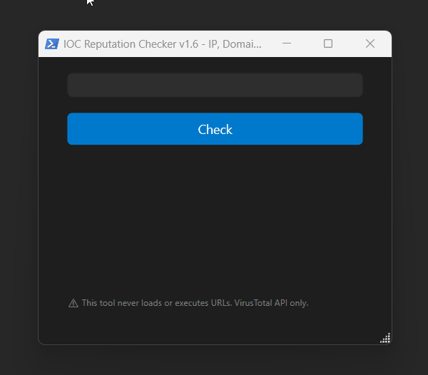
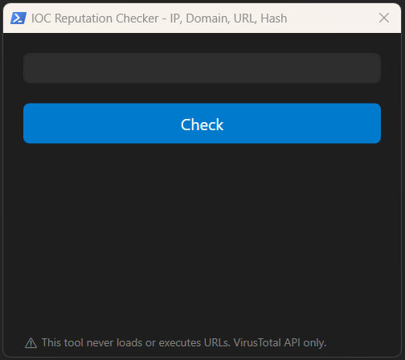
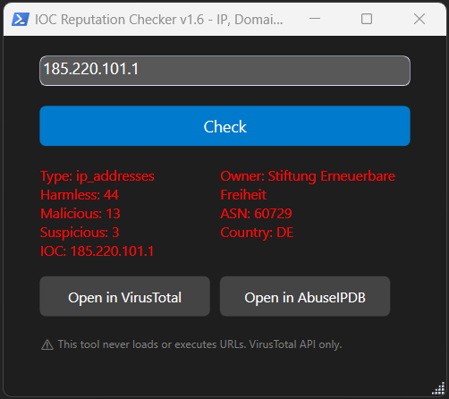
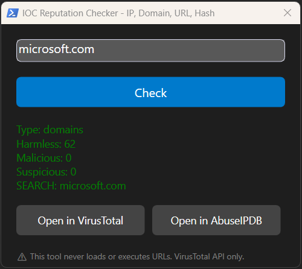
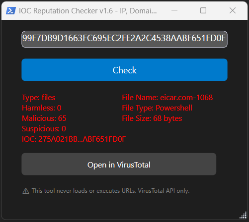

# IOC-Reputation-Checker

PowerShell-based widget designed to simplify IOC reputation analysis by integrating multiple threat intelligence sources into a lightweight and easy-to-use interface.

## Current Version

**Version:** v1.6 | **Status:** Active Development

Key Features:
- IP Intelligence (Owner, ASN, Country)
- Domain Intelligence (Registrar, Creation Date, Reputation)
- File Intelligence (File Name, File Type, File Size)
- Responsive and Resizable UI
- VirusTotal & AbuseIPDB Integration



## Overview

Security analysts frequently need to investigate indicators such as:

* IP Addresses
* Domains
* URLs
* File Hashes

Instead of manually opening multiple websites and performing repetitive lookups, this tool centralizes the investigation process and provides quick access to reputation information.

Currently supported integrations:

* VirusTotal
* AbuseIPDB

## Why I Built This Tool?

SOC Analysts often need to perform repetitive reputation checks across multiple platforms.

The idea behind the project was not to replace VirusTotal or AbuseIPDB, but rather to have a PowerShell tool that simplifies checking IOC reputations without the need to switch between tabs, thereby streamlining daily workflows.

## Changelog

### v1.6 (2026-06-22)
- Added Responsive UI
- Added Resizable Window Support
- Added Proportional UI Scaling using WPF Viewbox
- Added Minimum Window Size Controls

### v1.5 (2026-06-16)
- Added VirusTotal API Key Validation
- Added Long IOC Truncation
- Added Long File Name Truncation
- Improved Results Panel Readability

### v1.4 (2026-06-16)
- Added Hash Enrichment
  - File Name
  - File Type
  - File Size
- UI improvements: Truncated long IOC values for better readability

### v1.3 (2026-06-15)
- Added Domain Enrichment
  - Registrar
  - Creation Date
  - Reputation

### v1.2 (2026-06-07)
- Added IP Enrichment
  - Owner
  - ASN
  - Country

---

## Configuration

Insert your VirusTotal API Key in the following variable and run the file "IOC-Reputation-Checker.ps1":

```powershell
$ApiKey = ""
```

---

## Screenshots

### Main Window



### IOC Reputation Analysis

#### Check IP - Malicious



#### Check Domain - Clean


#### Check Hash - Malicious


---

## Features

### IOC Detection

Automatically identifies the input type:

* IPv4
* IPv6
* Domains
* URLs
* MD5 Hashes
* SHA1 Hashes
* SHA256 Hashes

### Threat Intelligence Integration

* VirusTotal reputation lookup
* AbuseIPDB reputation lookup
* Direct access to investigation portals

### Intelligence Enrichment

#### IP Intelligence
* Owner
* ASN
* Country

#### Domain Intelligence
* Registrar
* Creation Date
* Reputation

#### File Intelligence
* File Name
* File Type
* File Size

### Security Controls

* Basic input sanitization
* URL execution prevention
* HTTPS communication only
* TLS 1.2 enforcement

### User Interface

* Lightweight PowerShell WPF GUI
* Quick investigation workflow
* Keyboard support (Enter key)
* Visual severity indicators
* IOC-Specific Intelligence Panels

---

## Example Workflow

1. Enter an IOC.
2. Click **Check**.
3. Review reputation results.
4. Open the IOC directly in VirusTotal or AbuseIPDB for further investigation.

---

## Technologies

* PowerShell
* WPF
* VirusTotal API
* AbuseIPDB API

---

## Requirements

* Windows
* PowerShell 5.1 or later
* VirusTotal API Key

---

## Future Improvements

Planned enhancements include:

* VPN / Proxy identification
* Enhanced URL Recognition
* UI improvements

---

## Disclaimer

This tool is intended for educational, research, and operational cybersecurity purposes.

Users are responsible for complying with applicable policies, licensing terms, and API usage limitations.